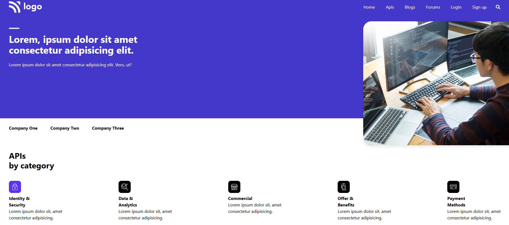
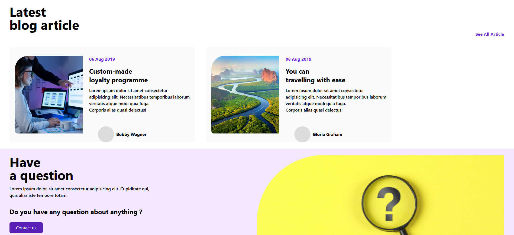
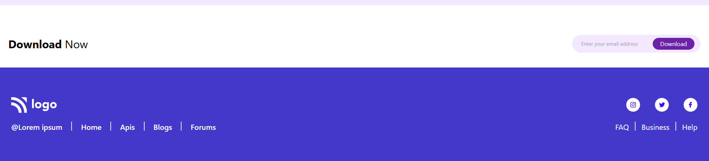

# 📘 Web Developer Landing Page

A modern, responsive landing page built using **HTML** and **Tailwind CSS**, designed for showcasing APIs, blogs, and developer-focused content. This project demonstrates clean UI structure, responsive design principles, and utility-first styling.

---

## 🚀 Features

* 📱 **Fully Responsive Design** (Mobile → Desktop)
* 🎨 **Modern UI/UX Layout**
* ⚡ **Tailwind CSS Integration**
* 🔤 **Custom Fonts** (Roboto, Lato, Orbitron)
* 🧭 **Responsive Navigation Bar**
* 📰 **Blog Section Layout**
* 🧩 **API Categories Showcase**
* 📩 **Email Subscription Form**
* 📌 **Footer with Social Links**

---

## 🛠️ Tech Stack

* **HTML5**
* **Tailwind CSS (CDN)**
* **Font Awesome Icons**
* **Google Fonts**

---


## 📂 Project Structure

```
project-folder/
│
├── index.html
├── images/
│   ├── Logo.png
│   ├── IMAGE HERE.png
│   ├── Rectangle.png
│   ├── Group 97.png
│   └── ...other assets
```

---

## 📸 Sections Overview







### 🔹 Hero Section

* Eye-catching banner with headline and supporting text
* Responsive image placement

### 🔹 Navigation Bar

* Desktop menu with hover effects
* Mobile hamburger menu

### 🔹 API Categories

* Visual cards representing different API domains:

  * Identity & Security
  * Data & Analytics
  * Commercial
  * Offers & Benefits
  * Payment Methods

### 🔹 Blog Articles

* Card-based layout
* Author info and publishing date

### 🔹 Call-to-Action

* “Have a question?” section
* Contact button

### 🔹 Subscription Section

* Email input with download CTA

### 🔹 Footer

* Navigation links
* Social media icons

---

## ⚙️ Setup & Usage

1. **Clone or download** the project

   ```bash
   git clone https://github.com/your-username/your-repo-name.git
   ```

2. Open `index.html` in your browser

> No build tools or installation required — runs directly in the browser.

---

## 🎯 Customization

* Replace images in the `/images` folder
* Update text content directly in `index.html`
* Modify styles using Tailwind utility classes
* Adjust fonts in the Tailwind config section

---

## 📈 Future Improvements

* Add JavaScript for interactive menu toggle
* Integrate real API data
* Improve accessibility (ARIA labels, semantic tags)
* Add animations (e.g., using Tailwind or libraries like AOS)
* Backend integration for form submission

---

## 📄 License

This project is open-source and available for personal and educational use.

---

## 👨‍💻 Author

Developed by **AMRITHA MOHANAN**

---

